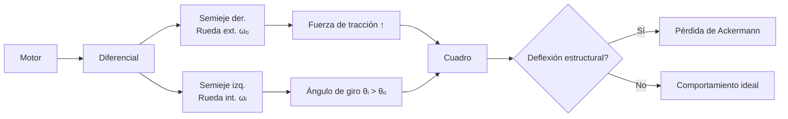

# Equipo [Team ValGrind]: WRO 2025

[](https://postimg.cc/fSTZzy81)

---

## Índice

- [Nuestro Equipo](#nuestro-equipo)
    - [Integrantes](#integrantes)
    - [Orígenes](#origenes)
    - [Nuestro Objetivo](#nuestro-objetivo)
- [El Robot](#el-robot)
    - [Apartado Mecánico](#apartado-mecanico)
        - [Diseño 3D](#impresion-3d)
        - [Movilidad](#movilidad)
            - [Videos del Robot](#videos-del-robot)
            - [Sistema de Movimiento y Tracción](#sistema-de-movimiento-y-tracción)
            - [Piezas de Mecánica (servo, ejes de transmisión, diferenciales)](#piezas-de-mecánica-servo-ejes-de-transmisión-diferenciales)
            - [Cálculo de la Reducción Total](#cálculo-de-la-reducción-total)
    - [Apartado Electrónico](#apartado-electronico)
        - [Piezas de electrónica](#piezas-de-electronica)
            - [Baterías](#baterías)
            - [Step Down](#step-down)
            - [Motor Driver](#motor-driver)
            - [Ultrasónicos](#ultrasonicos)
            - [PixyCam](#pixycam)
            - [Microcontroladores](#microcontroladores)
        - [Diagramas de Conexiones](#diagramas-de-conexiones)
    - [Apartado de Programación](#apartado-de-programacion)
        - Algoritmo de Navegacion
              - ROS2 (explicacion integral)
              - NAV2
              - MAnejo de nodos, topicos, etc etc
        - [Desafío Abierto](#desafio-abierto)
            - [Flowchart](#flowchart-desafio-abierto)
            - [Explicación del código](#explicacion-del-codigo-desafio-abierto)
        - [Desafío Cerrado](#desafio-cerrado)
            - [Flowchart](#flowchart-desafio-cerrado)
            - [Explicación del código](#explicacion-del-codigo-desafio-cerrado)
        - [Lista de Recursos para armar nuestro robot](#lista-de-recursos-para-armar-nuestro-robot)
        - [Licencia](#licencia)
---

## Nuestro Equipo

[](https://postimg.cc/rKqWdsNG)

Somos **[Team ValGrind]**, entusiastas de la robótica y la innovación. Representamos a nuestra institución en la fase regional de la **WRO 2025**.

---

### Integrantes

- **Samuel Burgos**  
  17 años, 09/01/2008

  > **Rol:** : **Programador**  
> *Especialista en Python y arquitectura de soluciones complejas. Domina GitHub y PyCharm además de algoritmos complejos*.
> **Fun Fact:**  
> *Su banda favorita es Foo Fighters* 


[](https://postimg.cc/BLgVJGSN)

- **Sebastián Salina**  
  17 años, 22/08/2008 

  > **Rol:** **Capitán**
> *Diseña piezas en 3D y además posee la capacidad de imprimir estos mismos al manejar una impresora 3D*  
> **Fun Fact:**  
> *Una vez imprimió un Pokémon gigante de filamento para Cristobal* 

[](https://postimg.cc/GH7xXcKJ)

- **Cristobal Mogollón**
   14 años, 14/07/2010
    
   > **Rol:**  **Programador**  
> *Se encarga principalmente de C++, Arduino IDE, y algunos aspectos de la electrónica.*  
> **Fun Fact:**  
> *Una vez le pidió a Sebastián imprimir un Pokémon gigante de filamento*
 [](https://postimg.cc/WdfddD3J)

- **Institución:** [Colegio Salto Ángel](https://www.instagram.com/colegiosaltoangel)
- **Instagram Oficial:** [@team_valgrind](https://instagram.com/team_valgrind)
- **Contáctanos:** [valgrind2025@gmail.com](mailto:valgrind2025@gmail.com)
- **Youtube:**
[Team ValGrind](https://youtube.com/@teamvalgrind?si=ZJbz7CX9eOX75H2U)

---

### Origenes

El nombre de nuestro equipo fue decidido por los tres integrantes a partir de un clásico compilador de C++ llamado de la misma forma, el cual es representado por un logotipo de un dragón hecho con origami. El nombre "ValGrind" también hace referencia a la mitología nórdica debido a las legendarias Valquirias que habitan en este.

 [](https://postimg.cc/gryddns4)


> ### ¿Por qué nuestro robot se llama Heimdall?

Este nombre no solo es un guiño a la mitología mencionada, sino que además corresponde al dios conocido como el guardián de las puertas de Asgard y del puente Bifröst, que conecta los Nueve Mundos. Al ser un personaje imponente, consideramos que es un nombre apropiado para representar a nuestro robot en la WRO.


## Nuestro Objetivo

[](https://postimg.cc/t1LyR68v)

#### "Diseñar, Construir y Programar"
 Un robot autónomo capaz de superar los desafíos de la WRO 2025, utilizando innovación y trabajo en equipo para lograr un desempeño sobresaliente en la etapa regional y avanzar a la nacional. Para llegar a esto, hemos pasado los últimos meses diseñando, construyendo, armando y programando nuestro más nuevo proyecto "Heimdall"

 
> [!NOTE]
> La World Robot Olympiad (WRO) es una competencia internacional de robótica educativa que se desarrolla en varias fases, y nuestro equipo lógicamente tiene que comenzar por la fase regional, mediante la cual al ganarla se accede a la Fase Nacional. Cada país organiza su propio torneo clasificatorio, donde equipos de jóvenes compiten en distintas categorías, aplicando conocimientos de robótica y STEAM. Por último, la fase a la cual nuestro equipo quiere llegar es la Final Internacional. Los equipos ganadores de cada país participan en la competencia global, donde enfrentan desafíos más complejos y compiten con representantes de más de 95 países 

[](https://postimg.cc/yJrQXB1B)

Aún así, nuestro único objetivo no es solamente ganar, como un equipo unido también tenemos la convicción de poder crear un robot no solo funcional, sino que llene nuestras expectativas; A pesar de ser intangible nuestro deseo de poder culminar nuestro proyecto como un equipo unido y verlo brillar, también es una meta importante para nosotros.

---

## El Robot

[](https://postimg.cc/Yv33pbFh)

### Apartado Mecanico

| [](https://postimg.cc/62RtZ2t4) | [](https://postimg.cc/NL6QfHdW)| 
| :--: | :--: | 
| *Frontal* | *Posterior* |
|[](https://postimg.cc/B8FnTwCv) | [](https://postimg.cc/YhtM4CVj)| 
| *Izquierda* | *Derecha* |
|[](https://postimg.cc/YLGgYxjf) |[](https://postimg.cc/w1fqYYwM) |
| *Superior* | *Inferior* |

#### Impresion 3D 

Antes de hablar de la movilidad o funcionalidad de nuestro robot, primero hay que explicar nuestros métodos de Diseño e Impresión 3D, los cuales se llevaron a cabo mediante Fusion 360


> [!NOTE]
> Fusion 360 es una plataforma de software de modelado 3D, CAD, CAM, CAE y PCB basada en la nube, destinada al diseño y la fabricación de productos. Nos permite diseñar y crear productos de acuerdo a sus especificaciones particulares, garantizando que cada pieza cumpla con los más exigentes criterios de estética, forma, ajuste y funcionalidad. Además, incorpora un conjunto integral de herramientas avanzadas para el diseño de placas de circuito impreso y componentes electrónicos, lo que facilita la conceptualización y materialización de cualquier idea, incluso las más complejas. Al implementar estas funciones, la plataforma optimiza significativamente tanto el tiempo como los costos asociados, asegurando que el proceso de producción se realice de manera eficiente y que las piezas obtenidas sean de la más alta calidad. Nosotros usamos esta herramienta gráfica y de diseño para realizar los diseños del chasis y las piezas personalizadas de nuestro robot.

[](https://postimg.cc/G96s8xCh)

#### Movilidad

Ahora bien, ya habiendo dilucidado como podemos elegir, diseñar y imprimir las piezas de nuestro robot, hay que asegurarnos de que este cuente con las herramientas necesarias para moverse y evadir los obstáculos de la pista.

> [!NOTE]
> Video de Heimdall realizando el Open Challenge
[Video](https://youtu.be/av_kJ_hcNXI?si=83bRdQo1FuN1ajur)

> [!NOTE]
> Video de Heimdall esquivando bloques del Closed Challenge 
[Video](https://youtu.be/y2dTKZ1CmCM?si=7QRf_ff8Sa_BZ0Na)

Nuestro robot emplea un sistema de tracción diferencial, ofreciendo maniobrabilidad precisa para enfrentar los retos del campo de competencia. El sistema de cruces se realiza mediante un servo que ajusta la dirección del robot en intersecciones de forma eficaz. También cabe destacar el hecho de que utilizamos una técnica llamada  Ackermann Positivo para emplear el sistema de movilidad de nuestro vehículo.

[](https://postimg.cc/30JGfBkv)

##### El diferencial de los vehículos, como su nombre lo indica, permite que exista una diferencia en la velocidad de giro entre la rueda interna y la rueda externa del vehículo cuando se da una vuelta o se está girando la dirección. No importa si el vehículo es tracción trasera o delantera, la función es la misma.

[](https://postimg.cc/G4sWpg3Z)

####  Sistema de Movimiento y Tracción 

Ahondando en lo mencionado anteriormente, Heimdall utiliza lo que normalmente es denominado sistema ackermann positivo, el cual es un sistema derivado del principio de Ackermann, cuyo objetivo es lograr que en curvas la **rueda interior (θᵢ) gire más que la exterior (θₒ)** para minimizar deslizamiento lateral (*scrub*).  

- **Ecuación fundamental**:  
  **cot(θₒ) - cot(θᵢ) = W / L**  
  - *W*: Distancia entre pivotes de dirección (batalla)  
  - *L*: Distancia entre ejes  
  

### **Implementación Física**
```asciidoc
[Rueda exterior (θₒ)]
  │
  ├─── Brazo de dirección  
  │        \  
[Cuadro]──┤         \  
  │        │          \  
  │        │           ●── Centro teórico (eje trasero)  
  │        │          /  
  │        │         /  
  ├─── Brazo de dirección  
  │  
[Rueda interior (θᵢ > θₒ)]
```

---

##### **Relación de Velocidades en Curva**

```
ωₒ / ωᵢ = (R + W/2) / (R - W/2)
```
- `ωₒ`: Velocidad angular rueda exterior.  
- `ωᵢ`: Velocidad angular rueda interior.  
- `R`: Radio de giro del centro del eje.  

---

##### **Fuerzas en Conflicto**



> [!WARNING]
> De utilizar estos sistemas, recomendamos tener cuidado con los siguientes inconvenientes los cuales aparecieron dentro de nuestras prácticas con la implementación del mencionado sistema:

1. **Paradox Steering**:  
   - *Causa*: La tracción en la rueda interior (baja adherencia) contrarresta el ángulo de giro.  
   - *Solución*: Control electrónico (freno vectorial).  

2. **Fatiga en semiejes**:  
   - *Causa*: Torsión excesiva en juntas homocinéticas debido a θᵢ máximo + par motor.  
   - *Solución*: Semiejes asimétricos con ángulos de trabajo optimizados.  

---

##### Soluciones de Ingeniería
-  **Estrategias Recomendadas**

| **Componente**   | **Innovación**                                    | **Beneficio**                                  |
|------------------|--------------------------------------------------|-----------------------------------------------|
| **Cuadro**       | Subchasis desmontable con rigidez variable.      | Permite ajustes finos en competición.         |
| **Diferencial**  | Electrónico con mapas por ángulo de giro.        | Regula par según θᵢ/θₒ (ej: Honda SH-AWD).   |
| **Dirección**    | Brazo de Ackermann ajustable (rótulas roscadas). | Compensa desgaste o cambios de neumáticos.    |

--- 


[](https://postimg.cc/8syssXPz)

El núcleo de la movilidad de nuestro robot reside en su **subsistema mecánico de transmisión y tracción**, cuidadosamente seleccionado con componentes específicos de alta calidad. Vamos a desglosar cómo cada pieza encaja en este rompecabezas de ingeniería en miniatura, usando la escala **1/18** como referencia clave para tamaño e integración:

1.  **Diferenciales y Ejes de Transmisión (1/18)**

[](https://postimg.cc/Cz6T56YC)

---

Los diferenciales se ubican en el eje motriz y permiten que las ruedas izquierda y derecha giren a velocidades diferentes al tomar curvas. Esta característica es fundamental para evitar que el robot patine o experimente esfuerzos innecesarios en giros cerrados, manteniendo así la estabilidad incluso durante maniobras agresivas. Su diseño a escala 1/18 asegura que sean compactos, ligeros y proporcionales al resto del chasis y ruedas del robot de competición.

Por otro lado, los ejes de transmisión conectan directamente la salida de los diferenciales (1/18) a las ruedas motrices. Son responsables de transferir el par motor generado hacia las ruedas, permitiendo el giro de los neumáticos. El diseño a escala 1/18 garantiza la longitud y resistencia necesarias para soportar las fuerzas de torsión y tracción, sin añadir peso excesivo ni desbalancear el robot.

En el caso particular del robot Heimdall, originalmente se consideró una transmisión 4x4. Sin embargo, tras observar las limitaciones en los ángulos de cruce y la maniobrabilidad, se optó por priorizar la movilidad. Por ello, se decidió retirar los ejes de transmisión delanteros, transformando el robot en un sistema de tracción 4x2.

---

#### Diferencias mas importantes entre transmisión 4x4 y 4x2 

| Característica                  | 4x4 (Tracción en las 4 ruedas)            | 4x2 (Tracción en 2 ruedas)                  |
|----------------------------------|-------------------------------------------|---------------------------------------------|
| **Motricidad**                  | Alta, ideal para terrenos irregulares o cruces complejos. | Moderada, suficiente para la mayoría de maniobras en pista controlada. |
| **Ángulo de cruce**             | Limitado por la presencia de ejes delanteros. | Mayor libertad de giro y mejor ángulo de cruce. |
| **Estabilidad en curvas**       | Más estable en condiciones extremas.       | Buena estabilidad, pero depende más del diseño del chasis y el diferencial. |
| **Peso total**                  | Mayor, por la cantidad extra de componentes (ejes y diferenciales delanteros). | Menor, lo que contribuye a una mejor relación peso-potencia.              |
| **Complejidad mecánica**        | Más alta; requiere mayor mantenimiento y ajuste. | Más sencilla, facilita el mantenimiento y reduce fallos mecánicos.         |
| **Consumo energético**          | Más elevado por la transmisión a cuatro ruedas. | Menor, lo que puede aumentar la autonomía.                                |
| **Aplicación recomendada**      | Terrenos difíciles, obstáculos, máxima tracción. | Pistas controladas, mayor maniobrabilidad y agilidad.                     |

2. **INJORA 7KG 2065 Digital Micro Servo**

El servo INJS2065 es un Servomotor compacto y de alto rendimiento, ideal para aplicaciones de robótica y modelismo a escala. A la hora de tener en cuenta tanto eficiencia como el manejo del espacio en un sistema embebido como el de un robot, el INJS2065 se destaca por sobre otros modelos. así como también destaca por su rápida velocidad de respuesta, alta precisión en el control de ángulo y considerable torque de retención. lo mencionado ut supra le permite operar eficientemente bajo diversas condiciones de carga. Su amplio rango de voltaje de operación, junto con un motor de núcleo y rodamientos de bolas, asegura durabilidad, flexibilidad y un funcionamiento suave, mientras que su tamaño reducido facilita su integración en diseños que requieren soluciones ligeras y confiables.

[](https://postimg.cc/bs6kKQT0)

| :wrench: **Especificaciones del Servo INJS2065** |                                                            |
|:------------------------------------------------|:----------------------------------------------------------:|
| **Banda muerta**                                | 2 μs                                                       |
| **Posición neutral**                            | 1500 μs / 330 Hz                                           |
| **Tipo de motor**                               | Motor de núcleo                                            |
| **Ángulo control remoto**                       | 90-120° ±2°                                                |
| **Ángulo (500-2500 μs)**                        | 180° ±2°                                                   |
| **Rango de voltaje**                            | 4.8V - 8.4V                                                |
| **Velocidad de operación (6.0V)**               | 0.09 s/60°                                                 |
| **Velocidad de operación (8.4V)**               | 0.06 s/60°                                                 |
| **Torque de retención (6.0V)**                  | 6.0 kg·cm / 83.3 oz·in                                     |
| **Torque de retención (8.4V)**                  | 7.0 kg·cm / 97.2 oz·in                                     |
| **Dimensiones**                                 | 23 × 13 × 25.8 mm                                          |
| **Peso**                                        | 20 g                                                       |
| **Longitud del cable conector**                 | JR 300 mm                                                  |
| **Rodamientos**                                 | 1BB                                                        |
| **Peso con empaque**                            | 28 g                                                       |
| **Tamaño del paquete**                          | 36 × 23 × 38 mm                                            |

---

| :wrench: **Herramientas requeridas**            |                                                            |
|:------------------------------------------------|:----------------------------------------------------------:|
| 1 × Destornillador hexagonal 1.5 mm             |                                                            |
| 1 × Destornillador hexagonal 2.0 mm             |                                                            |


3. ### Motor DC 12V Greartisan zga37irg9i

[](https://postimg.cc/LY0yTnX2)


Un Motor de Engranajes DC Greartisan es un tipo de motor eléctrico de corriente continua (DC) que tiene una caja de engranajes (también llamada reductora o caja reductora) integrada directamente en su construcción. La principal funcionalidad de este motor en un sistema robótico radica en su capacidad para ofrecer **alto par a velocidades reducidas**. A diferencia de un motor DC estándar que gira a muy altas RPM con poco par, el motor Greartisan integra una **caja de engranajes** (reductora) directamente en su diseño. Esta caja de engranajes transforma la velocidad de rotación del motor en una fuerza mucho mayor.
 El **eje de salida céntrico de 1.45 pulgadas de diámetro** proporciona una conexión robusta y directa a los sistemas mecánicos del robot, como ruedas, brazos articulados o mecanismos de elevación, asegurando que el par generado se transmita de manera eficiente.

> [!TIP]
>  Evita los movimientos bruscos y difíciles de controlar de los motores de alta velocidad sin reducción.
>     Aunque parezca contradictorio, al operar con una relación de engranajes adecuada, el motor puede trabajar más cerca de su punto de eficiencia óptima para la carga que está manejando, lo que puede resultar en un **menor consumo de energía** en comparación con un motor sin engranajes que lucha por alcanzar el par requerido.

### Especificaciones del Motor

| **Característica**                          | **Valor**                                         |
|---------------------------------------------|---------------------------------------------------|
| **Voltaje nominal**                         | 1
