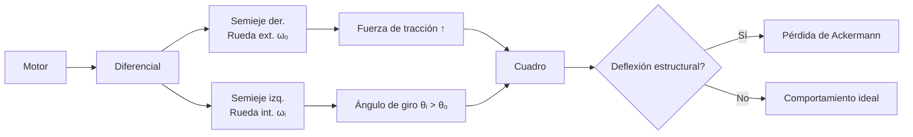
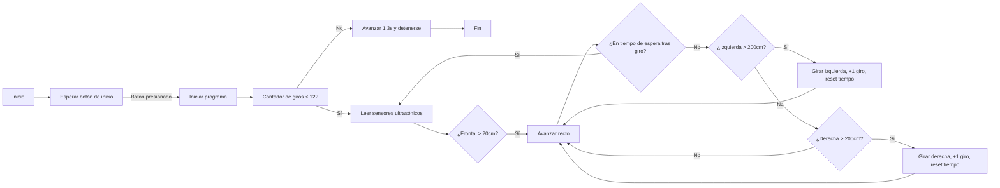
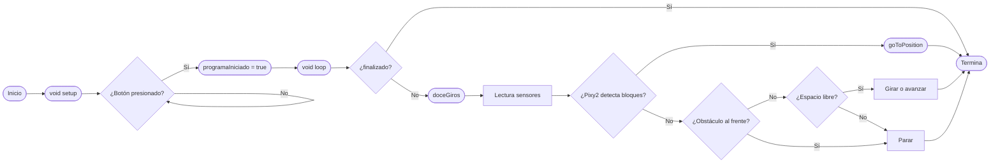

# Equipo [Team ValGrind]: WRO 2025

[](https://postimg.cc/fSTZzy81)

---

# Índice

- [Nuestro Equipo](#nuestro-equipo)
  - [Integrantes](#integrantes)
  - [Origenes](#origenes)
  - [Nuestro Objetivo](#nuestro-objetivo)
- [El Robot](#el-robot)
  - [Apartado Mecanico](#apartado-mecanico)
    - [Impresion 3D](#Impresion-3d)
    - [Movilidad](#movilidad)
      - [Videos del Robot](#videos-del-robot)
      - [Sistema de Movimiento y Traccion](#sistema-de-movimiento-y-traccion)
      - [Piezas de Mecanica](#piezas-de-mecanica)
      - [Calculo de la Reduccion Total](#calculo-de-la-reducción-total)
  - [Apartado Electronico](#apartado-electronico)
    - [Piezas de Electronica](#piezas-de-electronica)
       - [Baterias](#baterias)
       - [Step Down](#step-down)
       - [Motor Driver](#motor-driver)
       - [PixyCam](#pixycam)
    - [Microcontrolador](#microcontrolador)
       - [ESP32](#esp32)
       - [Diagrama de Conexiones](#diagrama-de-conexiones)
  - [Apartado de Programacion](#apartado-de-programacion)
     - [Desafio Abierto](#desafio-abierto)
       - [Flowchart Abierta](#flowchart-abierta)
       - [Explicacion del Codigo](#explicacion-del-codigo)
     - [Desafio Cerrado](#desafio-cerrado)
       - [Flowchart Cerrada](#flowchart-cerrada)
       - [Explicación del Código](#explicación-del-código-1)
    - [Lista de Recursos para armar nuestro robot](#lista-de-recursos-para-armar-nuestro-robot)
    - [Licencia](#licencia)
      
---

## _Nuestro Equipo_

[](https://postimg.cc/rKqWdsNG)

Somos **[Team ValGrind]**, entusiastas de la robótica y la innovación. Representamos a nuestra institución en la fase Nacionalq1ñq
qq de la **WRO 2025**.

---

### Integrantes

- **Samuel Burgos**  
  17 años, 09/01/2008

  > **Rol:** : **Programador**  
> *Especialista en Python. Domina GitHub y PyCharm además de algoritmos complejos*.
> **Fun Fact:**  
> *Su banda favorita es Foo Fighters* 


[](https://postimg.cc/BLgVJGSN)

- **Sebastián Salina**  
  17 años, 22/08/2008 

  > **Rol:** **Capitán**
> *Diseña piezas en 3D y además posee la capacidad de imprimir estos mismos al manejar una impresora 3D además de ser el mecánico del equipo*  
> **Fun Fact:**  
> *Una vez imprimió un Pokémon gigante de filamento para Cristobal* 

[](https://postimg.cc/GH7xXcKJ)

- **Cristobal Mogollón**
   14 años, 14/07/2010
    
   > **Rol:**  **Programador**  
> *Experto en C++, Arduino IDE, y el apartado Electrónico de nuestro robot*  
> **Fun Fact:**  
> *Una vez le pidió a Sebastián imprimir un Pokémon gigante de filamento*
 [](https://postimg.cc/WdfddD3J)

- **Institución:** [Colegio Salto Ángel](https://www.instagram.com/colegiosaltoangel)
- **Instagram Oficial:** [@team_valgrind](https://instagram.com/team_valgrind)
- **Contáctanos:** [valgrind2025@gmail.com](mailto:valgrind2025@gmail.com)
- **Youtube:**
[Team ValGrind](https://youtube.com/@teamvalgrind?si=ZJbz7CX9eOX75H2U)

---

### _Origenes_

El nombre de nuestro equipo fue decidido por los tres integrantes a partir de un clásico compilador de C++ llamado de la misma forma, el cual es representado por un logotipo de un dragón hecho con origami. El nombre "ValGrind" también hace referencia a la mitología nórdica debido a las legendarias Valquirias que habitan en este.

 [](https://postimg.cc/gryddns4)


> #### ¿Por qué nuestro robot se llama Heimdall?

Este nombre no solo es un guiño a la mitología mencionada, sino que además corresponde al dios conocido como el guardián de las puertas de Asgard y del puente Bifröst, que conecta los Nueve Mundos. Al ser un personaje imponente, consideramos que es un nombre apropiado para representar a nuestro robot en la WRO.

---  

### _Nuestro Objetivo_

[](https://postimg.cc/t1LyR68v)

#### "Diseñar, Construir y Programar"
 Un robot autónomo capaz de superar los desafíos de la WRO 2025, utilizando innovación y trabajo en equipo para lograr un desempeño sobresaliente en la etapa regional y avanzar a la nacional. Para llegar a esto, hemos pasado los últimos meses diseñando, construyendo, armando y programando nuestro más nuevo proyecto "Heimdall"

 
> [!NOTE]
> La World Robot Olympiad (WRO) es una competencia internacional de robótica educativa que se desarrolla en varias fases, y nuestro equipo lógicamente tiene que comenzar por la fase regional, mediante la cual al ganarla se accede a la Fase Nacional. Cada país organiza su propio torneo clasificatorio, donde equipos de jóvenes compiten en distintas categorías, aplicando conocimientos de robótica y STEAM. Por último, la fase a la cual nuestro equipo quiere llegar es la Final Internacional. Los equipos ganadores de cada país participan en la competencia global, donde enfrentan desafíos más complejos y compiten con representantes de más de 95 países 

[](https://postimg.cc/yJrQXB1B)

Aún así, nuestro único objetivo no es solamente ganar, como un equipo unido también tenemos la convicción de poder crear un robot no solo funcional, sino que llene nuestras expectativas; A pesar de ser intangible nuestro deseo de poder culminar nuestro proyecto como un equipo unido y verlo brillar, también es una meta importante para nosotros.

---

## _El Robot_

[](https://postimg.cc/Yv33pbFh)

### _Apartado Mecanico_

| [](https://postimg.cc/R3Kr5tk9) | [](https://postimg.cc/Mv2WnWY9)| 
| :--: | :--: | 
| *Frontal* | *Posterior* |
|[](https://postimg.cc/pm5YqJjW) | [](https://postimg.cc/rD5RDnWr)| 
| *Izquierda* | *Derecha* |
|[](https://postimg.cc/cvDyBZQy) | [](https://postimg.cc/njKt7m2T) |
| *Superior* | *Inferior* |

#### _Impresion 3D_

Antes de hablar de la movilidad o funcionalidad de nuestro robot, primero hay que explicar nuestros métodos de Diseño e Impresión 3D, los cuales se llevaron a cabo mediante Fusion 360


> [!NOTE]
> Fusion 360 es una plataforma de software de modelado 3D, CAD, CAM, CAE y PCB basada en la nube, destinada al diseño y la fabricación de productos. Nos permite diseñar y crear productos de acuerdo a sus especificaciones particulares, garantizando que cada pieza cumpla con los más exigentes criterios de estética, forma, ajuste y funcionalidad. Además, incorpora un conjunto integral de herramientas avanzadas para el diseño de placas de circuito impreso y componentes electrónicos, lo que facilita la conceptualización y materialización de cualquier idea, incluso las más complejas. Al implementar estas funciones, la plataforma optimiza significativamente tanto el tiempo como los costos asociados, asegurando que el proceso de producción se realice de manera eficiente y que las piezas obtenidas sean de la más alta calidad. Nosotros usamos esta herramienta gráfica y de diseño para realizar los diseños del chasis y las piezas personalizadas de nuestro robot.

[](https://postimg.cc/G96s8xCh)

#### _Movilidad_

Ahora bien, ya habiendo dilucidado como podemos elegir, diseñar y imprimir las piezas de nuestro robot, hay que asegurarnos de que este cuente con las herramientas necesarias para moverse y evadir los obstáculos de la pista.

#### _Videos Del Robot_

> [!NOTE]
> Video de Heimdall realizando el Open Challenge
[Video](https://youtu.be/A_cvS-tfQbw?si=AHV0PGeCZv9EyR4f)

> [!NOTE]
> Video de Heimdall realizando el Closed Challenge 
[Video](https://youtu.be/xPg1Bdj31Bs?si=Ma-bSzcdHcq5AbVu)

Nuestro robot emplea un sistema de tracción diferencial, ofreciendo maniobrabilidad precisa para enfrentar los retos del campo de competencia. El sistema de cruces se realiza mediante un servo que ajusta la dirección del robot en intersecciones de forma eficaz. También cabe destacar el hecho de que utilizamos una técnica llamada  Ackermann Positivo para emplear el sistema de movilidad de nuestro vehículo.

[](https://postimg.cc/30JGfBkv)

##### El diferencial de los vehículos, como su nombre lo indica, permite que exista una diferencia en la velocidad de giro entre la rueda interna y la rueda externa del vehículo cuando se da una vuelta o se está girando la dirección. No importa si el vehículo es tracción trasera o delantera, la función es la misma.

[](https://postimg.cc/G4sWpg3Z)

####  _Sistema de Movimiento y Traccion_

Ahondando en lo mencionado anteriormente, Heimdall utiliza lo que normalmente es denominado sistema ackermann positivo, el cual es un sistema derivado del principio de Ackermann, cuyo objetivo es lograr que en curvas la **rueda interior (θᵢ) gire más que la exterior (θₒ)** para minimizar deslizamiento lateral (*scrub*).  

- **Ecuación fundamental**:  
  **cot(θₒ) - cot(θᵢ) = W / L**  
  - *W*: Distancia entre pivotes de dirección (batalla)  
  - *L*: Distancia entre ejes  
  

#### **Implementación Física**
```asciidoc
[Rueda exterior (θₒ)]
  │
  ├─── Brazo de dirección  
  │        \  
[Cuadro]──┤         \  
  │        │          \  
  │        │           ●── Centro teórico (eje trasero)  
  │        │          /  
  │        │         /  
  ├─── Brazo de dirección  
  │  
[Rueda interior (θᵢ > θₒ)]
```

---

##### **Relación de Velocidades en Curva**

```
ωₒ / ωᵢ = (R + W/2) / (R - W/2)
```
- `ωₒ`: Velocidad angular rueda exterior.  
- `ωᵢ`: Velocidad angular rueda interior.  
- `R`: Radio de giro del centro del eje.  

---

##### **Fuerzas en Conflicto**



> [!WARNING]
> De utilizar estos sistemas, recomendamos tener cuidado con los siguientes inconvenientes los cuales aparecieron dentro de nuestras prácticas con la implementación del mencionado sistema:

1. **Paradox Steering**:  
   - *Causa*: La tracción en la rueda interior (baja adherencia) contrarresta el ángulo de giro.  
   - *Solución*: Control electrónico (freno vectorial).  

2. **Fatiga en semiejes**:  
   - *Causa*: Torsión excesiva en juntas homocinéticas debido a θᵢ máximo + par motor.  
   - *Solución*: Semiejes asimétricos con ángulos de trabajo optimizados.  

---

##### _Soluciones de Ingeniería_
-  **Estrategias Recomendadas**

| **Componente**   | **Innovación**                                    | **Beneficio**                                  |
|------------------|--------------------------------------------------|-----------------------------------------------|
| **Cuadro**       | Subchasis desmontable con rigidez variable.      | Permite ajustes finos en competición.         |
| **Diferencial**  | Electrónico con mapas por ángulo de giro.        | Regula par según θᵢ/θₒ (ej: Honda SH-AWD).   |
| **Dirección**    | Brazo de Ackermann ajustable (rótulas roscadas). | Compensa desgaste o cambios de neumáticos.    |

--- 


[](https://postimg.cc/8syssXPz)


#### _Piezas de Mecanica_
El núcleo de la movilidad de nuestro robot reside en su **subsistema mecánico de transmisión y tracción**, cuidadosamente seleccionado con componentes específicos de alta calidad. Vamos a desglosar cómo cada pieza encaja en este rompecabezas de ingeniería en miniatura, usando la escala **1/18** como referencia clave para tamaño e integración:

1.  **Diferenciales y Ejes de Transmisión (1/18)**

[](https://postimg.cc/Cz6T56YC)

---

Los diferenciales se ubican en el eje motriz y permiten que las ruedas izquierda y derecha giren a velocidades diferentes al tomar curvas. Esta característica es fundamental para evitar que el robot patine o experimente esfuerzos innecesarios en giros cerrados, manteniendo así la estabilidad incluso durante maniobras agresivas. Su diseño a escala 1/18 asegura que sean compactos, ligeros y proporcionales al resto del chasis y ruedas del robot de competición.

Por otro lado, los ejes de transmisión conectan directamente la salida de los diferenciales (1/18) a las ruedas motrices. Son responsables de transferir el par motor generado hacia las ruedas, permitiendo el giro de los neumáticos. El diseño a escala 1/18 garantiza la longitud y resistencia necesarias para soportar las fuerzas de torsión y tracción, sin añadir peso excesivo ni desbalancear el robot.

En el caso particular del robot Heimdall, originalmente se consideró una transmisión 4x4. Sin embargo, tras observar las limitaciones en los ángulos de cruce y la maniobrabilidad, se optó por priorizar la movilidad. Por ello, se decidió retirar los ejes de transmisión delanteros, transformando el robot en un sistema de tracción 4x2.

---

#### Diferencias mas importantes entre transmisión 4x4 y 4x2 

| Característica                  | 4x4 (Tracción en las 4 ruedas)            | 4x2 (Tracción en 2 ruedas)                  |
|----------------------------------|-------------------------------------------|---------------------------------------------|
| **Motricidad**                  | Alta, ideal para terrenos irregulares o cruces complejos. | Moderada, suficiente para la mayoría de maniobras en pista controlada. |
| **Ángulo de cruce**             | Limitado por la presencia de ejes delanteros. | Mayor libertad de giro y mejor ángulo de cruce. |
| **Estabilidad en curvas**       | Más estable en condiciones extremas.       | Buena estabilidad, pero depende más del diseño del chasis y el diferencial. |
| **Peso total**                  | Mayor, por la cantidad extra de componentes (ejes y diferenciales delanteros). | Menor, lo que contribuye a una mejor relación peso-potencia.              |
| **Complejidad mecánica**        | Más alta; requiere mayor mantenimiento y ajuste. | Más sencilla, facilita el mantenimiento y reduce fallos mecánicos.         |
| **Consumo energético**          | Más elevado por la transmisión a cuatro ruedas. | Menor, lo que puede aumentar la autonomía.                                |
| **Aplicación recomendada**      | Terrenos difíciles, obstáculos, máxima tracción. | Pistas controladas, mayor maniobrabilidad y agilidad.                     |

2. Claro, aquí tienes el texto actualizado para un servo **INJORA 2065 360°** (rotación continua), manteniendo el formato markdown y adaptando la descripción y tabla a este tipo de servo:

---

**INJORA 7KG 2065 Digital Micro Servo 360°**

El servo INJS2065 360° es un micro servo digital compacto, de alto par y rotación continua, especialmente orientado a aplicaciones de robótica móvil, automatización y sistemas de tracción donde se requiere control de velocidad y dirección más que de posición angular fija. Gracias a su diseño robusto y eficiente, el servo 2065 360° es ideal para sistemas embebidos que demandan movimiento continuo, como robots seguidores de línea, plataformas móviles y mecanismos de accionamiento. Destaca por su alta precisión en el control de velocidad, rápida respuesta y una excelente relación peso-potencia, permitiendo así su integración en diseños ligeros y eficientes. Su motor de núcleo con rodamientos de bolas proporciona un funcionamiento suave y duradero, mientras que el amplio rango de voltaje soportado le otorga flexibilidad para diferentes sistemas de control.

[](https://postimg.cc/bs6kKQT0)

| :wrench: **Especificaciones del Servo INJS2065 360°** |                                                    |
|:------------------------------------------------------|:--------------------------------------------------:|
| **Tipo**                                              | Servo de rotación continua, digital                |
| **Banda muerta**                                      | 2 μs                                               |
| **Señal de control**                                  | PWM (500-2500 μs, 330 Hz)                         |
| **Motor**                                             | Motor de núcleo                                    |
| **Rango de voltaje**                                  | 4.8V - 8.4V                                        |
| **Velocidad de operación (6.0V)**                     | 0.09 s/60° (aprox. 110 rpm)                        |
| **Velocidad de operación (8.4V)**                     | 0.06 s/60° (aprox. 150 rpm)                        |
| **Torque de retención (6.0V)**                        | 6.0 kg·cm / 83.3 oz·in                             |
| **Torque de retención (8.4V)**                        | 7.0 kg·cm / 97.2 oz·in                             |
| **Dimensiones**                                       | 23 × 13 × 25.8 mm                                  |
| **Peso**                                              | 20 g                                               |
| **Longitud del cable conector**                       | JR 300 mm                                          |
| **Rodamientos**                                       | 1BB                                                |
| **Peso con empaque**                                  | 28 g                                               |
| **Tamaño del paquete**                                | 36 × 23 × 38 mm                                    |
| **Modo de control**                                   | Velocidad y dirección según ancho de pulso PWM     |
| **Posición neutra (detenido)**                        | ~1500 μs                                           |
| **Giro horario**                                      | PWM > 1500 μs (más ancho, más rápido)              |
| **Giro antihorario**                                  | PWM < 1500 μs (más estrecho, más rápido)           |

---

| :wrench: **Herramientas requeridas**            |                                                            |
|:------------------------------------------------|:----------------------------------------------------------:|
| 1 × Destornillador hexagonal 1.5 mm             |                                                            |
| 1 × Destornillador hexagonal 2.0 mm             |                                                            |

---

3. ### Motor DC 12V Greartisan zga37irg9i

[](https://postimg.cc/LY0yTnX2)


Un Motor de Engranajes DC Greartisan es un tipo de motor eléctrico de corriente continua (DC) que tiene una caja de engranajes (también llamada reductora o caja reductora) integrada directamente en su construcción. La principal funcionalidad de este motor en un sistema robótico radica en su capacidad para ofrecer **alto par a velocidades reducidas**. A diferencia de un motor DC estándar que gira a muy altas RPM con poco par, el motor Greartisan integra una **caja de engranajes** (reductora) directamente en su diseño. Esta caja de engranajes transforma la velocidad de rotación del motor en una fuerza mucho mayor.
 El **eje de salida céntrico de 1.45 pulgadas de diámetro** proporciona una conexión robusta y directa a los sistemas mecánicos del robot, como ruedas, brazos articulados o mecanismos de elevación, asegurando que el par generado se transmita de manera eficiente.

> [!TIP]
>  Evita los movimientos bruscos y difíciles de controlar de los motores de alta velocidad sin reducción.
>     Aunque parezca contradictorio, al operar con una relación de engranajes adecuada, el motor puede trabajar más cerca de su punto de eficiencia óptima para la carga que está manejando, lo que puede resultar en un **menor consumo de energía** en comparación con un motor sin engranajes que lucha por alcanzar el par requerido.

### Especificaciones del Motor

| **Característica**                          | **Valor**                                         |
|---------------------------------------------|---------------------------------------------------|
| **Voltaje nominal**                         | 12V                                               |
| **Velocidad**                               | 10 RPM                                            |
| **Material**                                | Metal                                             |
| **Par nominal**                             | 33.1 lbs·cm                                       |
| **Relación de reducción interna**           | 1:314                                             |
| **Corriente nominal**                       | 0.05A                                             |
| **Tamaño del eje de salida (forma D)**      | 6 × 14 mm (0.24" × 0.55") (D × L)                 |
| **Tamaño de la caja de cambios**            | 37 × 31 mm (1.46" × 1.22") (D × L)                |
| **Tamaño del motor**                        | 36.2 × 33.3 mm (1.43" × 1.31") (D × L)            |

#### _Calculo de la Reduccion total_

Para adaptar la salida del motor a las necesidades del robot, realizamos un cálculo de la reducción total combinando la reducción interna del motor con la de un sistema de engranajes externo. Utilizamos un piñón de ataque estándar (acoplado al eje del motor) y engranajes de 17 y 28 dientes.

La relación de reducción adicional por engranajes se calcula así:
- Si el piñón tiene, por ejemplo, 10 dientes, y el engranaje acoplado tiene 28 dientes, la reducción es 28/10 = 2.8.
- Si se agregan más etapas de engranajes (por ejemplo, usando un engranaje intermedio de 17 dientes), la reducción se multiplica por cada etapa.

La reducción total del sistema es:

```
Reducción total = Reducción interna del motor × (dientes engranaje grande / dientes piñón)
```

Con el Piñón de lego de 36 dientes acomplado a nuestro motor, transmitiendo su fuerza de rotación al Piñon de 16 dientes obtenemos un aumento de 2.11 veces la velocidad original del motor (550 rpm) obteniendo así 1164.7 rpm, siendo reducidos por el Piñón de ataque a una reducción de 1:2.24 
Dando un total de 521 rpm las cuales se transmiten directamente a los ejes de transmisión conectados a las ruedas

#### ¿Por qué es importante la reducción?

Dos palabras clave: `Velocidad` y `Torque`. Al aumentar la reducción, la velocidad de salida disminuye, permitiendo un control más preciso del robot, y paralelamente  La reducción aumenta el torque disponible en las ruedas, lo que mejora la capacidad de mover el robot o superar obstáculos.

### Razones para elegir este motor y sistema de r
educción

- **Versatilidad y control:** El motor de 12V es estándar y confiable. La reducción interna más la reducción por engranajes externos se adapta perfectamente a las necesidades del robot.
- **Adaptabilidad:** Cambiando los engranajes externos se puede ajustar fácilmente la velocidad y el torque final.
- **Eficiencia y disponibilidad:** Los componentes son fáciles de conseguir y económicos.

---

4.  **Tornillos, Tuercas de Seguridad y Arandelas (M2 y M3)**

[](https://postimg.cc/cvHx5n1h)

 ##### Ya sean M2 o M3, son piezas imprescindibles para la mecanica de nuestro robot, debido a la fijacion de piezas pequeñas, estabilización de componentes, y la garantía de seguridad que otorgan con respecto al uso prolongado del robot ya sea en practicas o en la competición.
 ##### Se decidió tomar la decisión de tener tornillos M2 y M3 de forma simultánea para velar por la eficiencia del espacio, para permitir compatibilidad con los componentes más pequeños, y al mismo tiempo para garantizar que los tornillos resistan y permitan estabilidad en el robot.
     
---

### _Apartado Electronico_

#### _Piezas de Electronica_
Para el proyecto, decidimos usar;

#### **Baterias**

[](https://postimg.cc/K3Nx86D1)

##### Diseñadas para potenciar el rendimiento en competiciones de robótica como la WRO, las baterías Tenergy NiMH de 12 V y 2000 mAh ofrecen dos ventajas críticas: su ausencia de efecto memoria garantiza máxima capacidad en cada uso tras recargas frecuentes (ideal para sesiones de prueba extensas), y su formato compacto (1.969x1.142x2.835 pulgadas) con cables desnudos facilita la integración en espacios reducidos de robots. Con carga rápida ≤1A y larga vida útil, son una solución fiable para  cuando necesitemos usarlas por un tiempo prolongado, ya sea en la propia competición o en pruebas.

> [!TIP]
> Para maximizar rendimiento y seguridad en robots**, cargue siempre estas baterías con un cargador compatible NiMH (como el Tenergy 6V-12V) a ≤1A para evitar sobrecalentamiento y prolongar su vida útil (~500 ciclos). Durante competiciones WRO, monitoree la temperatura (detenga si supera 45°C) y verifique el voltaje post-uso (>10.8V ideal); evite descargas profundas (<0.9V/celda) recargando tras 3-4 sesiones. Almacénelas con 40-60% de carga en ambiente fresco (15-25°C), realice mantenimiento cada 4 semanas si no se usan, y en robots proteja el pack contra golpes con aislante anti-vibración. 

| Característica                         | Detalle                                   |
|-----------------------------------------|-------------------------------------------|
| Dimensiones del producto                | 2,13 x 2,91 x 1,22 pulgadas               |
| ASIN                                    | B077Y9HNTF                                |
| Número de modelo del producto           | 19676                                     |
| Pilas                                   | 10 12V (Tipo de pila necesaria)           |
| Opinión media de los clientes           | 4.5 de 5 estrellas (748 opiniones)        |
| Clasificación en los más vendidos       | nº108,878 en Salud y Hogar                |
|                                         | nº250 en Pilas 12 V                       |
| Descatalogado por el fabricante         | No                                        |
| Producto en amazon.com desde            | marzo 10, 2018                            |
| Voltaje                                 | 12 Voltios                                |
| Reutilización                           | Recargable                                |
| Peso de la batería                      | 225 Gramos                                |
| Dimensiones del artículo LxWxH          | 2,13 x 2,91 x 1,22 pulgadas               |
| Peso del artículo                       | 255 Gramos                                |
| Amperaje                                | 1 Amperios                                |
| UPC                                     | 844949030014                              |
| Fabricante                              | Tenergy                                   |


### **Step Down**

[](https://postimg.cc/RJML9J83)


##### El LM2596 es un regulador step down DC-DC diseñado para transformar tensiones elevadas en niveles adecuados para circuitos electrónicos.  Acepta un rango de entrada entre 3.2 y 40V, Lo cual evidentemente demuestra que es un componente electrónico bastante versátil en lo que al manejo de voltaje respecta, por lo tanto nuestro equipo decidió utilizarlo para poder manejar el voltaje en el circuito del robot de forma idónea.

---

### ** Cuadro Resumen del Datasheet**  
| **Parámetro**             | **Valor/Descripción**                  | **Puntos Relevantes**                                                          |     |
| ------------------------- | -------------------------------------- | ------------------------------------------------------------------------------ | --- |
| **Rango de entrada**      | 3.2–40 V DC                            | Compatible con baterías LiPo (7.4V), Pb-ácido (12V), o paneles solares.        |     |
| **Rango de salida**       | 1.25–37 V DC ajustable                 | Ideal para microcontroladores (5V), sensores (3.3V) o motores (6–12V).         |     |
| **Corriente máxima**      | 3 A (pico), 2 A continuo sin disipador | Suficiente para servomotores, drivers de motores, o sistemas de control.       |     |
| **Eficiencia**            | Hasta 92% , ≈73% @3A                   | Reduce pérdidas térmicas vs. reguladores lineales, crucial en sesiones largas. |     |
| **Frecuencia**            | 150 kHz                                | Permite usar componentes magnéticos pequeños (compacto).                       |     |
| **Temperatura operativa** | -40°C a +85°C                          | Funciona en entornos extremos (competiciones exteriores).                      |     |
| **Dimensiones**           | 45×20×14 mm (estándar)                 | Fácil integración en espacios reducidos de robots.                             |     |
| **Protecciones**          | Limitación de corriente                | Previene daños por cortocircuitos en cables o motores.                         |     |
|                           |                                        |                                                                                |     |

---

### Funcionamiento Técnico 
El LM2596 sigue una topología **buck clásica** con cuatro componentes clave:  
1. **Interruptor (MOSFET)**: Regula el flujo de energía mediante PWM a 150 kHz .  
2. **Bobina (inductor)**: Almacena energía magnética durante el ciclo "ON" y la libera en el "OFF", estabilizando el voltaje .  
3. **Diodo**: Cierra el circuito durante la fase de descarga de la bobina .  
4. **Capacitor**: Filtra rizados (<50 mV ), crucial para microcontroladores sensibles al ruido.  

> [!TIP]
>     - Usar disipador si la corriente supera 1.5A .  
>  - Monitorear temperatura con termómetro IR (>45°C indica riesgo) .  
  - Mantener diferencia mínima de **1.5V entre entrada/salida** (ej: 7.4V entrada → 5V salida) .  
  - Para motores, agregar un **fusible de 2–3A** en serie .    
  - Usar cables AWG 18+ para corrientes >2A .  
  - Evitar loops largos en entrada/salida para reducir rizado.  

---

#### Motor Driver

[](https://postimg.cc/Jy29P1P3)

Es un **controlador de motores de doble puente H (dual H-bridge)** encapsulado en un circuito integrado. Su función principal es actuar como un "intermediario de potencia" entre dispositivos de control de baja potencia (como Arduino) y motores de alta potencia (como tu motor DC 12V).

**Es extremadamente útil para nuestro proyecto debido a su:**

1. **Amplificación de corriente:**  
   - Los microcontroladores solo pueden entregar ~20-40mA por pin.  
   - El L298N soporta hasta **2A por canal** (suficiente para motores medianos).  
2. **Control direccional:**  
   - Permite invertir la polaridad del voltaje aplicado al motor para cambiar su giro (adelante/atrás).  
3. **Protección eléctrica:**  
   - Aísla el circuito de control de los picos de voltaje generados por el motor.  
4. **Manejo de alta tensión:**  
   - Soporta motores de 5V a 35V (ideal para tu motor 12V).  

---

#### **Partes clave del módulo L298N:**  
| **Componente**      | **Función**                                                                 |
|---------------------|-----------------------------------------------------------------------------|
| **Puertos de salida** (OUT1, OUT2, OUT3, OUT4) | Conectan los motores (2 motores DC o 1 motor paso a paso).                  |
| **Entradas lógicas** (IN1, IN2, IN3, IN4) | Reciben señales de control desde Arduino (determinan dirección).          |
| **Pines de habilitación** (ENA, ENB) | Activan/desactivan los canales (con/sin PWM).                             |
| **Regulador de 5V** | Provee energía a la lógica (puede alimentar al Arduino si se usa el jumper).|
| **Disipador de calor** | Metálico, previene sobrecalentamiento durante uso prolongado.             |
| **Jumpers**         | Configuran el modo de operación (ej: habilitación permanente de canales). |

---

#### **¿Cómo controla un motor DC?**  
Usa un circuito **puente H (H-bridge)** interno:  
``` 
   [IN1] --[SW1]---- Motor ----[SW3]-- [IN2]  
               |                   |  
              [SW2]               [SW4]  
```  
- **Giro adelante:**  
  `IN1 = HIGH` (SW1 cerrado) + `IN2 = LOW` (SW4 cerrado) → Corriente fluye: SW1 → Motor → SW4  
- **Giro atrás:**  
  `IN1 = LOW` (SW2 cerrado) + `IN2 = HIGH` (SW3 cerrado) → Corriente fluye: SW3 → Motor → SW2  
- **Frenado:**  
  `IN1 = HIGH` + `IN2 = HIGH` → Cortocircuito en bornes del motor (frena rápidamente).  

---

#### PixyCam

[](https://postimg.cc/p9wVTN3Z)

La **Pixy2** es una cámara de visión artificial diseñada para robots que requieren detección rápida y fiable de objetos, colores y códigos de barras. Junto con su software **PixyMon**, forma un ecosistema accesible para principiantes y avanzados, ideal para la detección de los bloques del desafío cerrado. A diferencia de soluciones basadas en cámaras genéricas, Pixy2 procesa imágenes *onboard* con algoritmos optimizados, liberando al microcontrolador principal (Arduino, Raspberry Pi) de tareas intensivas. Su enfoque en **"aprender por demostración"** simplifica el entrenamiento sin necesidad de programación compleja.

---

### ** Cuadro de Datos Técnicos**  
| **Parámetro**             | **Pixy2 CMUcam5**                               | **Puntos Relevantes**                                                |     |
| ------------------------- | ----------------------------------------------- | -------------------------------------------------------------------- | --- |
| **Sensor**                | Sony IMX322 (1/4")                              | Captura 60 FPS en baja luz (torneos indoor/outdoor).                 |     |
| **Resolución**            | 1296×976 (RAW), 400×296 (procesada)             | Balance óptimo entre detección y velocidad.                          |     |
| **Detección**             | Colores (7 firmas), Líneas, Códigos QR, Objetos | Ideal para seguimiento de trayectorias, identificación de objetivos. |     |
| **Interfaces**            | UART, SPI, I²C, USB, GPIO                       | Conexión directa a Arduino, Raspberry Pi, PLCs.                      |     |
| **Latencia**              | <3 ms (por objeto)                              | Respuesta en tiempo real para robots ágiles.                         |     |
| **Consumo**               | 140 mA @ 5V (máx.)                              | Alimentable desde puerto USB o fuente de robot.                      |     |
| **Algoritmos integrados** | RANSAC, Vectorización                           | Detección precisa de líneas incluso con curvas o rupturas.           |     |
| **Dimensiones/Weight**    | 40×40×13 mm / 26 g                              | Montaje en drones o mini-robots sin afectar movilidad.               |     |

---

###  Configuración para Entrenamiento de Detección de Colores

[](https://postimg.cc/mPBmLMfz) 

1. **Preparación del entorno**:  
   - Iluminar el objeto uniformemente (evite sombras/reflejos).  
   - Usar fondos contrastados (ej: objeto rojo sobre fondo blanco).  

2. **Captura de firmas (signatures)**:  
   - Conecte Pixy2 vía USB y abrir PixyMon → Menú `Action` → `Set signature...`.  
   - Presione el botón físico en Pixy2 o haga clic en `Detect objects` para capturar el color.  
   - Ajuste la sensibilidad con el deslizador `Saturation` (alto para colores vivos, bajo para pasteles).  

3. **Afinación avanzada**:  
   - En `Expert mode`, defina rangos HSV (`Hue`, `Saturation`, `Value`) para reducir falsos positivos.  
   - Use `Color codes` para crear códigos de barras con 2-3 colores (ej: logotipo de competencia WRO).  

4. **Pruebas en tiempo real**:  
   - Active `Frame view` en PixyMon para ver detecciones superpuestas (objetos = rectángulos, líneas = vectores).  
   - Ajuste `Min/max area` para filtrar objetos por tamaño (evitar ruido).   

#### Microcontrolador

##### ESP-32

[](https://postimg.cc/f3gkzvyJ)

##### El **ESP32-WROOM** es un módulo todo-en-uno potente y económico basado en el chip ESP32, que integra un **procesador dual-core de hasta 240 MHz**, **Wi-Fi 802.11 b/g/n (2.4 GHz)**, y **Bluetooth (Clásico y BLE)**, junto con **4 MB de memoria flash SPI y 520 KB de RAM** en el mismo encapsulado, además de una antena PCB integrada; ofrece múltiples periféricos (GPIOs, ADC, DAC, UART, SPI, I2C, PWM, etc.), soporta modos de bajo consumo para baterías, y es ideal para proyectos de IoT, domótica, robótica o interfaces, siendo fácil de programar con Arduino IDE, ESP-IDF o MicroPython.
##### Además del microcontrolador, también es necesario tener un buen entorno con las librerías necesarias para compilar y interpretar el código, y eventualmente crear un ecosistema óptimo para nuestro robot. Por esto, hemos decidido utilizar 4 librerías esenciales para lograr nuestro objetivo:

1.  **`Wire.h` (Comunicación I²C):**  
    Esencial para conectar sensores, pantallas (OLED) o memorias (EEPROM) que usen el bus I²C. Con `Wire.begin(SDA, SCL)` configuras los pines, luego usas `Wire.beginTransmission()`, `Wire.write()`, `Wire.read()` y `Wire.endTransmission()` para enviar/recibir datos. A partir de esta librería establecemos comunicación con el ESP-32.

2.  **`NewPing` (Sensor de Distancia Ultrasónico):**
La librería NewPing simplifica y optimiza el uso de sensores ultrasónicos como el HC-SR04. Se inicializa con NewPing sonar(TRIG, ECHO, MAX_DISTANCE), y métodos como sonar.ping_cm() devuelven la distancia en centímetros de forma rápida y precisa. Es ideal para proyectos que requieren detección de proximidad sin contacto, como evitar obstáculos en pistas, prevenir colisiones con paredes internas o externas, sistemas de estacionamiento, y robótica móvil. NewPing maneja automáticamente la generación y recepción de pulsos ultrasónicos, mejora la velocidad de medición y reduce errores gracias a funciones avanzadas como mediciones medianas y control de tiempo máximo de eco.

3.  **`ESP32Servo.h` (Control de Servomotores):**  
    Librería específica para manejar servos en el ESP32, ya que los timers PWM son distintos a Arduino. Con `servo.attach(PIN)` configuras y `servo.write(grados)` posicionas el servo (0°-180°). Crucial para manejar automatismos y conseguir movimiento angular preciso con motores de bajo torque.

4.  **`PixySPI2.h` (Cámara Inteligente Pixy2):**  
    Facilita la comunicación con la cámara Pixy2 (vía SPI) para visión artificial simple. Detecta objetos por color, formas (bloques) o líneas. Usas `pixy.init()` y `pixy.ccc.getBlocks()` para obtener datos. A partir de la pixy, podemos crear código que pueda identificar los bloques verdes, rojos, y el estacionamiento magenta para que actúe acorde y pueda realizar el desafío cerrado.

5 **`SPI.h` (Comunicación SPI en Arduino):**
    La librería SPI.h facilita la comunicación rápida y síncrona entre Arduino (como maestro) y dispositivos periféricos mediante el protocolo Serial Peripheral Interface (SPI). Se inicializa con SPI.begin(), y permite enviar y recibir datos simultáneamente con SPI.transfer(). Es ideal para conectar sensores, memorias, pantallas, y otros módulos que requieren alta velocidad y comunicación full-duplex en distancias cortas. SPI maneja automáticamente las señales de reloj, selección de esclavos (SS), y líneas de datos (MOSI y MISO), simplificando la gestión del bus. Además, ofrece funciones para configurar la velocidad, orden de bits y modo de reloj, adaptándose a distintos dispositivos y aplicaciones industriales o robóticas.

### ¿Por qué Pixy2SPI.h?

 La decisión entre usar **`Pixy2SPI.h`** (comunicación SPI) o **`Pixy2.h`** (comunicación I2C) fue un problema con el que nos encontramos apenas comenzamos a utilizar la PixyCam™. En nuestra experiencia, podemos declarar que el protocolo de comunicación SPI transmite datos de forma más rápida que mediante I²C, y por tanto creemos que vale la pena el elegir Pixy2SPI para poder recibir `signatures`
y datos apenas la pixy los procese

### **1. Rendimiento y Velocidad**  
- **`Pixy2SPI.h` (SPI)**:  
  - **Velocidad máxima**: Hasta **10 Mbps** (dependiendo del microcontrolador).  
  - **Ventaja**: Ideal para aplicaciones que requieren **alta velocidad** (ej: robots en competiciones, procesamiento en tiempo real).  
  - SPI es **full-duplex**, permitiendo transmisión y recepción simultáneas.  

- **`Pixy2.h` (I2C)**:  
  - **Velocidad máxima**: Típicamente **400 kHz** (modo estándar) o **1 MHz** (modo rápido).  
  - **Limitación**: Puede causar cuellos de botella si se transfieren muchos bloques/objetos por fotograma.  

> [!WARNING] 
> ☑️ **Elige SPI si:** Necesitas máxima velocidad (ej: seguimiento de objetos rápidos, FPS alto).
> 
> ☑️**Elige SPI si:** Trabajas en entornos eléctricamente ruidosos (un robot de la WRO)

---

#### Otras razones por las cuales el protocolo SPI nos resultó favorable en testeo y ejecución de la PixyCam en pista:

##### **SPI**:  
  - **Menos susceptible a ruido** gracias a señales de reloj dedicadas y conexiones punto a punto.  
  - Ideal para entornos con motores o fuentes de interferencia (ej: competiciones **FIRST Robotics**).  

##### **I2C**:  
  - Más sensible al ruido debido a su diseño multi-dispositivo en 2 cables.  
  - Puede requerir pull-up resistors adicionales para evitar fallos.  


---

### Diagrama de Conexiones

[](https://postimg.cc/4nZHP0Br)

---
### Apartado de Programacion

##### Flowchart Abierta

En este diagrama de flujo se halla una representación gráfica del funcionamiento lógico de nuestra programación, así como de lo que se espera sea el desempeño del robot al inicializar el programa.



##### Explicacion del Codigo

- Definición de Pines y Constantes

```cpp

// Pines ESP32 para sensores ultrasónicos
#define USTFRONT 12    // Trigger del sensor frontal
#define USEFRONT 13    // Echo del sensor frontal  
#define USTLEFT 14     // Trigger del sensor izquierdo
#define USELEFT 27     // Echo del sensor izquierdo
#define USTRIGHT 25    // Trigger del sensor derecho
#define USERIGHT 26    // Echo del sensor derecho

#define MAX_DISTANCE 357  // Distancia máxima de medición en cm

// Pines de control
#define IN2 17         // Control motor (puente H)
#define IN1 16         // Control motor (puente H)
#define PIN_SERVO 2    // Señal del servomotor
#define PIN_BOTON 15   // Entrada del botón de inicio
```


Cada sensor ultrasónico necesita 2 pines: Trigger (envía señal) y Echo (recibe eco)

MAX_DISTANCE: Límite práctico del sensor HC-SR04

IN1/IN2: Controlan la dirección del motor mediante puente H

PIN_SERVO: Controla la posición del servo de dirección

- Instanciación de Objetos

```cpp
NewPing USFRONT(USTFRONT, USEFRONT, MAX_DISTANCE);
NewPing USLEFT(USTLEFT, USELEFT, MAX_DISTANCE);
NewPing USRIGHT(USTRIGHT, USERIGHT, MAX_DISTANCE);

Servo myservo;
```

Crea objetos para interactuar con los sensores y el servo usando las librerías.

- Parámetros de Control
```cpp

const int DISTANCIA_OBSTACULO_FRONTAL = 20;    // Umbral frontal para detección
const int DISTANCIA_OBSTACULO_LATERAL = 200;   // Umbral lateral para giros
const unsigned long DURACION_GIRO_I = 420;     // Tiempo giro izquierda (ms)
const unsigned long DURACION_GIRO_D = 350;     // Tiempo giro derecha (ms)
const unsigned long TIEMPO_ESPERA_GIRO = 300;  // Espera entre giros (ms)

Valores optimizados experimentalmente:

    20cm frontal: Distancia segura para detectar obstáculos sin chocar

    200cm lateral: Indica que hay espacio suficiente para girar

    420ms/350ms: Tiempos calibrados para giros de 90 grados

    300ms: Evita giros consecutivos demasiado rápidos
```

-  Variables de Estado
```cpp
bool programaIniciado = false;    // Control de inicio del programa
bool finalizado = false;          // Indica si completó los 12 giros

unsigned long tiempoUltimoGiro = 0;  // Marca temporal del último giro
int contadorGiros = 0;               // Cuenta giros realizados
```

- Función setup() - Inicialización
```cpp

void setup() {
  myservo.attach(PIN_SERVO);      // Vincula servo al pin
  Serial.begin(115200);           // Inicia comunicación serial

  // Configuración de pines
  pinMode(PIN_BOTON, INPUT_PULLUP);  // Botón con resistencia pull-up interna
  pinMode(IN1, OUTPUT);           // Salida para control motor
  pinMode(IN2, OUTPUT);           // Salida para control motor

  // Estado inicial
  digitalWrite(IN1, LOW);         // Motor apagado
  digitalWrite(IN2, LOW);         // Motor apagado
  myservo.write(98);              // Servo en posición central

  Serial.println("Esperando pulsar botón para iniciar...");
}

Flujo de inicialización:

    Configura hardware

    Establece estado seguro (motor off, servo centrado)

    Espera señal de inicio
```

- Función loop() - Bucle Principal

```cpp

void loop() {
  if (!programaIniciado) {
    // Espera activa del botón
    if (digitalRead(PIN_BOTON) == LOW) {
      programaIniciado = true;
      Serial.println("Botón presionado, iniciando programa...");
      delay(500);  // Anti-rebote
    }
  } else if (!finalizado) {
    docegiros();  // Ejecuta lógica principal
  }
  // Si finalizado, el loop no hace nada
}
```

- Función docegiros() - Lógica Principal

```cpp
void docegiros() {
  unsigned long ahora = millis();  // Tiempo actual

  // Lectura de sensores
  int frontal = USFRONT.ping_cm();
  int izquierda = USLEFT.ping_cm();
  int derecha = USRIGHT.ping_cm();

  // Filtrado de valores erróneos
  if (frontal == 357) frontal = -1;
  if (izquierda == 357) izquierda = -1;
  if (derecha == 357) derecha = -1;

Procesamiento de lecturas:

    ping_cm(): Método de NewPing que devuelve distancia en cm

    357cm: Valor que indica medición fuera de rango → se convierte a -1

cpp

  // Verificación de finalización
  if (contadorGiros >= 12) {
    if (!finalizado) {
      Serial.println("Se alcanzaron 12 giros, avanzando 1 segundo más y deteniéndose.");
      Adelante();
      delay(250);
      Parar();
      finalizado = true;
    }
    return;  // Sale de la función
  }

Lógica de finalización:

    Después de 12 giros, avanza 250ms extra y se detiene permanentemente

cpp

  // Toma de decisiones de movimiento
  if (frontal != -1 && frontal > DISTANCIA_OBSTACULO_FRONTAL) {
    Adelante();  // Avanza si no hay obstáculo frontal
    
    // Verifica si puede girar (respetando tiempo de espera)
    if (ahora - tiempoUltimoGiro > TIEMPO_ESPERA_GIRO) {
      if (izquierda != -1 && izquierda > DISTANCIA_OBSTACULO_LATERAL) {
        // Giro a izquierda
        Serial.println("Girando a la izquierda por más de 190 cm libres");
        delay(200);  // Pequeña pausa antes de girar
        Izquierda();
        contadorGiros++;
        tiempoUltimoGiro = millis();
        Adelante();
      } else if (derecha != -1 && derecha > DISTANCIA_OBSTACULO_LATERAL) {
        // Giro a derecha  
        Serial.println("Girando a la derecha por más de 190 cm libres");
        Derecha();
        contadorGiros++;
        tiempoUltimoGiro = millis();
        Adelante();
      }
    }
  }
}

Algoritmo de decisión:

    ¿Hay camino frontal? → Avanzar

    ¿Pasó el tiempo de espera desde último giro? → Evaluar giros

    ¿Hay espacio a izquierda? → Girar izquierda

    ¿Hay espacio a derecha? → Girar derecha

    Actualizar contadores y temporizadores
```

9. Funciones de Movimiento

```cpp

void Adelante() {
  digitalWrite(IN1, HIGH);  // Activa motor
  digitalWrite(IN2, LOW);   // Dirección forward
  Serial.println("Motor en marcha hacia adelante");
}

void Parar() {
  digitalWrite(IN1, LOW);   // Desactiva motor
  digitalWrite(IN2, LOW);
  Serial.println("Motor detenido");
}

Control del motor:

    IN1=HIGH, IN2=LOW: Motor adelante

    IN1=LOW, IN2=LOW: Motor detenido (frenado)

void Izquierda() {
  digitalWrite(IN1, HIGH);  // Motor activo
  myservo.write(128);       // Servo a posición izquierda
  
  // Giro controlado por tiempo
  unsigned long inicio = millis();
  while (millis() - inicio < DURACION_GIRO_I) {
    // Espera activa durante el giro
  }
  
  myservo.write(96);        // Vuelve a centro
  digitalWrite(IN1, LOW);   // Detiene motor
  Serial.println("Giro izquierda completado");
}

void Derecha() {
  digitalWrite(IN1, HIGH);
  myservo.write(38);        // Servo a posición derecha
  
  unsigned long inicio = millis();
  while (millis() - inicio < DURACION_GIRO_D) {
    // Espera activa durante el giro
  }
  
  myservo.write(100);       // Vuelve a centro
  digitalWrite(IN1, LOW);
  Serial.println("Giro derecha completado");
}

Mecánica de giro:

    128: Ángulo para giro izquierda (servo gira a la derecha)

    38: Ángulo para giro derecha (servo gira a la izquierda)

    96/100: Posiciones centrales (diferencia por calibración)

    Los giros se controlan por tiempo, no por feedback
```

##### Desafío Cerrado

##### Flowchart Cerrada

En este diagrama de flujo se halla una representación gráfica del funcionamiento lógico de nuestra programación, así como de lo que se espera sea el desempeño del robot al inicializar el programa.



##### Explicacion del Código
Desafío Cerrado - Análisis de Componentes Clave
1. Sistema de Comunicación Dual SPI
cpp

// VSPI para Pixy2 (alto rendimiento)
#define VSPI_MISO 19
#define VSPI_MOSI 23  
#define VSPI_SCK  18

// HSPI para SD (compatibilidad)
#define HSPI_MISO 39
#define HSPI_MOSI 32  
#define HSPI_SCK  33

SPIClass hspi(HSPI);  // Segundo bus SPI independiente

Arquitectura:

    VSPI: Bus rápido para Pixy2 (necesita alta velocidad)

    HSPI: Bus separado para SD (evita interferencias)

    Los buses trabajan independientemente

2. Máquina de Estados
cpp

enum Estado {
  DETENIDO,                   // 0 - Inactivo
  AVANZAR,                    // 1 - Navegación normal
  ESQUIVAR_VERDE_IZQ,         // 2 - Esquiva bloque verde izquierda
  ESQUIVAR_ROJO_DER,          // 3 - Esquiva bloque rojo derecha
  ESQUIVA_PREVENTIVA_VERDE_DER, // 4 - Esquiva preventiva
  ESQUIVA_PREVENTIVA_ROJO_IZQ, // 5 - Esquiva preventiva
  // ... más estados
};

Transiciones de estado:

    Cada estado representa un comportamiento específico

    Las transiciones dependen de sensores y temporizadores

    Permite comportamiento complejo mediante estados simples

3. Control PID con Giroscopio
cpp

const float kP = 1.3;   // Ganancia proporcional
const float kI = 0.01;  // Ganancia integral  
const float kD = 0.11;  // Ganancia derivativa

void aplicarCorreccionGiroscopio() {
  mpu.update();
  float anguloRaw = mpu.getAngleZ();
  float anguloZ = anguloRaw - offsetAngleZ;  // Aplica calibración
  float error = -anguloZ;  // Error es la desviación del cero
  
  // Cálculo PID
  float deltaTime = (currentTime - prevTime) / 1000.0;
  integralError += error * deltaTime;
  float derivative = (error - prevError) / deltaTime;
  float output = kP * error + kI * integralError + kD * derivative;
  
  // Aplicar corrección al servo
  int correccion = ANGULO_CENTRO + (int)output;
  correccion = constrain(correccion, ANGULO_MIN, ANGULO_MAX);
  myservo.write(correccion);
}

Componentes PID:

    Proporcional (kP): Corrección proporcional al error actual

    Integral (kI): Corrige error acumulado (deriva gradual)

    Derivativo (kD): Amortigua oscilaciones (cambios bruscos)

4. Detección de Colores con Pixy2
cpp

void leerPixy() {
  digitalWrite(SD_CS, HIGH);  // Desactiva SD
  delay(2);
  digitalWrite(PIXY_CS, LOW); // Activa Pixy2
  delay(2);
  
  pixy.ccc.getBlocks();  // Obtiene bloques detectados
  
  digitalWrite(PIXY_CS, HIGH); // Desactiva Pixy2
  delay(2);
  
  if (pixy.ccc.numBlocks) {
    for (int i = 0; i < pixy.ccc.numBlocks; i++) {
      int centroX = pixy.ccc.blocks[i].m_x;
      int area = pixy.ccc.blocks[i].m_width * pixy.ccc.blocks[i].m_height;
      
      // Determina posición relativa
      if (centroX < mitadPantalla - UMBRAL_CENTRO_PIXY) {
        posicionBloqueX = -1; // Izquierda
      } else if (centroX > mitadPantalla + UMBRAL_CENTRO_PIXY) {
        posicionBloqueX = 1;  // Derecha
      } else {
        posicionBloqueX = 0;  // Centro
      }
      
      // Clasifica por color
      if (pixy.ccc.blocks[i].m_signature == 1) { // Verde
        bloqueVerdeDetectado = true;
        bloqueVerdeCercano = (area > UMBRAL_TAMANO_BLOQUE_VERDE);
      }
    }
  }
}

Procesamiento de visión:

    m_x: Posición horizontal del objeto (0-315)

    m_width/m_height: Dimensiones del objeto detectado

    m_signature: Código de color (1=verde, 2=rojo)

    El área determina si el objeto está cerca

5. Sistema de Esquivas
cpp

case ESQUIVAR_VERDE_IZQ:
  tiempoFaseActual = millis() - tiempoInicioManiobra;
  
  if (tiempoFaseActual < TIEMPO_ESQUIVA_PRIMARIA_VERDE) {
    // Fase 1: Giro inicial
    myservo.write(ANGULO_CENTRO + ANGULO_ESQUIVA_PRIMARIO);
    avanzar();
  } else if (tiempoFaseActual < TIEMPO_ESQUIVA_PRIMARIA_VERDE + TIEMPO_RECTA_ENTRE_GIROS) {
    // Fase 2: Avance recto
    myservo.write(ANGULO_CENTRO);
    avanzar();
  } else if (tiempoFaseActual < TIEMPO_ESQUIVA_VERDE) {
    // Fase 3: Corrección
    myservo.write(ANGULO_CENTRO - ANGULO_ESQUIVA_SECUNDARIO);
    avanzar();
  } else {
    // Finaliza esquiva
    estadoActual = POST_ESQUIVA_VERDE;
    tiempoInicioManiobra = millis();
  }
  break;

Secuencia de esquiva:

    Giro evasivo: Aleja del obstáculo

    Avance recto: Distancia de seguridad

    Recuperación: Vuelve a la trayectoria

    Post-esquiva: Ajustes finales

6. Gestión de Memoria y Calibración
cpp

bool guardarCalibracion(float offset) {
  File archivo = SD.open("/calibracion.txt", FILE_WRITE);
  archivo.printf("offset: %.8f\n", offset);
  archivo.printf("angulo_inicial: %.8f\n", anguloInicial);
  archivo.close();
}

bool cargarCalibracion(float &offset) {
  File archivo = SD.open("/calibracion.txt");
  String contenido = archivo.readString();
  // Parsea offset y ángulo inicial
  archivo.close();
  
  // Verifica validez
  float diferencia = abs(anguloActual - anguloInicial);
  if (diferencia > 15.0) return false; // Calibración inválida
}

Persistencia de calibración:

    Guarda offset del giroscopio en SD

    Verifica integridad al cargar

    Ajusta automáticamente si hay pequeñas desviaciones

7. Control de Tiempos y Sincronización
cpp

unsigned long tiempoInicioManiobra = 0;
unsigned long tiempoFaseActual = 0;

// En cada estado:
tiempoFaseActual = millis() - tiempoInicioManiobra;

if (tiempoFaseActual < TIEMPO_ESQUIVA_PRIMARIA_VERDE) {
  // Fase 1 activa
} else if (tiempoFaseActual < TIEMPO_ESQUIVA_PRIMARIA_VERDE + TIEMPO_RECTA_ENTRE_GIROS) {
  // Fase 2 activa
}

Sistema temporal:

    millis(): Tiempo desde inicio (no se resetea)

    tiempoInicioManiobra: Marca cuando comenzó el estado actual

    tiempoFaseActual: Duración en el estado actual

    Permite transiciones temporizadas precisas

Esta arquitectura permite un control robusto y adaptable para el desafío cerrado, combinando percepción visual, control de movimiento preciso y gestión de estados complejos.


#### Comunicacion

- **Lenguaje principal:** C+
- **Comunicación:** Dual SPI, Serial Communication, UART
---

## Recursos para Hacer el Robot

| Producto | Cantidad | Precio | Tipo | Link |
|---|---|---|---|---|
| Tenergy TB-6AB Balance Charger Discharger 1S-6S | 1 | 39.99$ | Electrónico | [Enlace](https://a.co/d/g4CIJV4) |
| Tenergy 2 Pack 12V 2000mAh Battery Packs RC | 1 | 39.99$ | Electrónico | [Enlace](https://a.co/d/7CcqbaV) |
| 1683 Pcs M3 Screw Assortment | 2 | 16.99$ | Herramienta | [Enlace](https://a.co/d/hlXXkAq) |
| Vertical Heat Press Machine-Heat Set Insert Tool | 1 | 56.99$ | Herramienta | [Enlace](https://a.co/d/0QgemD) |
| FNIRSI HS-02A 100W Portable Corded Soldering Iron Kit | 1 | 95.99$ | Herramienta | [Enlace](https://a.co/d/7zn4xyp) |
| Kit de amortiguación y dirección escala 1/24 | 1 | 33$ | Herramienta | [Enlace](https://a.co/d/1lKXhpT) |
| Caja de engranajes diferenciales escala 1/28 | 1 | 14$ | Herramienta | [Enlace](https://a.co/d/7Y6jsIC) |
| Diferenciales y ejes de transmisión 1/28 | 1 | 27$ | Mecánico | [Enlace](https://a.co/d/1KSovrP) |
| Conectores XT30 | 1 | 13$ | Electrónico | [Enlace](https://a.co/d/6dxQdtF) |
| Conectores XT90 | 1 | 23$ | Electrónico | [Enlace](https://a.co/d/9AgJER6) |
| Servomotores Injora 2065 7kg (3 Pcs) | 1 | 48$ | Mecánico | [Enlace](https://a.co/d/hfQbhOa) |
| Brazo de Servomotor Injora 25T | 1 | 9$ | Mecánico | [Enlace](https://a.co/d/9PtCohQ) |
| ESP32 | 1 | 10$ | Electrónico | [Enlace](https://www.amazon.com/ESP32-WROOM-32-Development-ESP-32S-Bluetooth-Arduino/dp/B084KWNMM4) |
| Step Down LM2596 | 1 | 6$ | Electrónico | [Enlace](https://robu.in/product/lm2596s-dc-dc-buck-converter-power-supply/) |
| Puente H L298N | 1 | 8$ | Electrónico | [Enlace](https://robu.in/product/l298-based-motor-driver-module-2a/)|
| PixyCam 2 | 1 | 69.99$ | Electrónico | [Enlace](https://a.co/d/i1WNaRs) |
| Motor Greartisan ZGA37IRG9I | 1 | 30$ | Mecánico |  |
| Giroscopio acelerometro Mpu6050 | 1 | 11$ | Electrónico | [Enlace](https://a.co/d/4NUOxoY) |
| Piñones de 5mm 1/8 13T y 14T | 1 | 12$ | Mecánico | [Enlace](https://a.co/d/0mrfcDG) |
| Piñones de 5mm 1/8 11T y 12T | 1 | 12$ | Mecánico | [Enlace](https://a.co/d/7t5SzPr) |
| Kit de conectores JST y DUPONT | 1 | 36$ | Electrónico | [Enlace](https://a.co/d/52pePQ9) |
| Kit de motor y variador de velocidad brushless, MBL32 y PURPLE VIPER 1721 1/18 | 1 | 60$ | Electrónico | [Enlace](https://a.co/d/6NRLPNy) |
| Tornillos M2 | 1 | 15$ | Mecánico | [Enlace](https://a.co/d/3gXOiNX) |
| Tuercas de Seguridad M2 | 1 | 10$ | Mecánico | [Enlace](https://a.co/d/1h8A71e) |
| Incertos roscados M2 | 1 | 9$ | Mecánico | [Enlace](https://a.co/d/eDrxGjF) |
| Tornillos M3 | 1 | 20$ | Mecánico | [Enlace](https://a.co/d/hlXXkAq) |
| Tuercas de Seguridad M3 | 1 | 7$ | Mecánico | [Enlace](https://a.co/d/2cXIxsE) |
| Incertos roscados M3 | 1 | 10$ | Mecánico | [Enlace](https://a.co/d/dOq3qJt) |
| Grasa de Litio Permatex | 1 | 11$ | Mecánico | [Enlace](https://a.co/d/6L1D8vk) |
| Cable trenzado 18 AWG | 1 | 11$ | Electrónico | [Enlace](https://a.co/d/7DPsW0) |
| Cable trenzado 22 AWG | 1 | 10$ | Electrónico | [Enlace](https://a.co/d/8ggmQSb) |
| Cable trenzado 26 AWG | 1 | 10$ | Electrónico | [Enlace](https://a.co/d/5TG2W9) |
| Filamento PETG para impresión 3D | 1 | 27$ | Electrónico | [Enlace](https://a.co/d/5QT5sDC) |
| Base de fijación de insertos roscados M2-M8 | 1 | 57$ | Electrónico | [Enlace](https://a.co/d/0QgemD) |
| Cautin Inalambrico de 100W | 1 | 95$ | Electrónico | [Enlace](https://a.co/d/7zn4xyp) |
| Filamento Pet-cf con Fibra de Carbono Bambu Lab 0.5kg 1.75mm | 1 | 60$ | Mecánico | [Enlace](https://articulo.mercadolibre.com.ve/MLV-769899404-filamento-pet-cf-con-fibra-de-carbono-bambu-lab-05kg-175mm-_JM?attributes=COLOR_SECONDARY_COLOR%3ATMvcm8%3D) |
| Kit de Actualización de Hotend Cerámico Ender V3 Se/Ke | 1 | 40$ | Mecánico | [Enlace](https://articulo.mercadolibre.com.ve/MLV-821933486-kit-de-actualizacion-de-hotend-ceramico-ender-3-v3-seke-_JM) |
| Secador de Filamento Space Pi | 1 | 85$ | Mecánico | [Enlace](https://articulo.mercadolibre.com.ve/MLV-768138623-creality-secador-de-filamento-space-pi-_JM) |
| Secador de Filamento Space Pi Plus | 1 | 140$ | Mecánico | [Enlace](https://articulo.mercadolibre.com.ve/MLV-821894608-creality-secador-de-filamento-space-pi-plus-_JM) |
| Ejes de transmisión escala 1/18 | 1 | 11$ | Mecánico | [Enlace](https://www.amazon.com/dp/B09P1QV29K) |
| Rolineras | 1 | 8.5$ | Mecánico | [Enlace](https://www.amazon.com/dp/B07XYPLPFL) |
| Grasa 8cc | 1 | 8$ | Mecánico | [Enlace](https://www.amazon.com/dp/B009PBVYPK) |
| Nudillos de cruce | 1 | 19$ | Mecánico | [Enlace](https://www.amazon.com/dp/B07D68MR25) |
| Rolineras | 1 | 10$ | Mecánico | [Enlace](https://www.amazon.com/dp/B0DXV2QMN4) |
| Ruedas de 40mm | 1 | 9$ | Mecánico | [Enlace](https://www.amazon.com/dp/B0DL8LJDH4) |
| Espaciadores y tornillos de nylon m3 | 1 | 17$ | Mecánico | [Enlace](https://www.amazon.com/dp/B0CBPGKDP4) |
| Diferenciales y ejes de transmisión escala 1/18 | 1 | 22$ | Mecánico | [Enlace](https://www.amazon.com/dp/B08GHC4D5M) |

---

> _¿Quieres contribuir o seguir nuestro avance? Síguenos en nuestras redes oficiales y revisa este repositorio para novedades y recursos_
